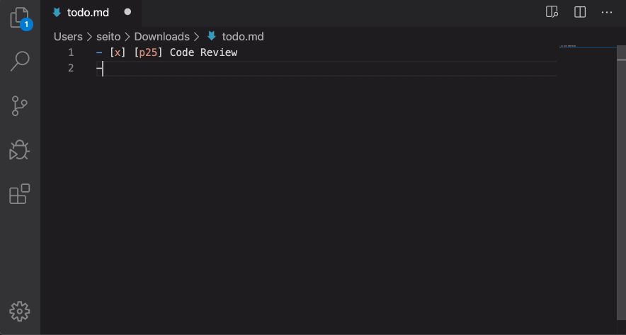

#  Pomodoro Edit for VSCode

Pomodoro Timer with the simplest text syntax.



## Installation

Marketplace: https://marketplace.visualstudio.com/items?itemName=seitotanaka.vscode-pomodoro-edit

## Syntax

```md
- [ ] [(p25 p5)4] xxx (four pomodoros 🍅🍅🍅🍅) 
- [ ] [p25] xxx (single timer)
```

💡Ctrl+Space: Autocomplete above syntax

### Start timer

```md
- [ ] [(p25 p5)4] xxx (when after save, start timer)
```

### Finish timer

```md
- [x] [(p25 p5)4] xxx
```

### Pause timer

```md
- [ ] [-(p25 p5)4] xxx
```

### Retry timer

```md
- [ ] [(p25 p5)4] xxx. (when after enter dots and save, retry timer)
```

## Tips

If multiple timers are required, pause the next timer beforehand so that the timer does not start unintentionally.

```md
- [x] [(p25 p5)4] xxx
- [ ] [-(p25 p5)4] yyy
- [ ] [-(p25 p5)4] zzz
```

## Add-ons

- Get desktop notifications: [Chrome Extension](https://chrome.google.com/webstore/detail/pomodoro-edit/mijjbmjlpkgjjpfkekdjgnkemlcfpcpo).
- Get e-mail notifications: [seachicken/pomodoro-edit-notifier](https://github.com/seachicken/pomodoro-edit-notifier).
